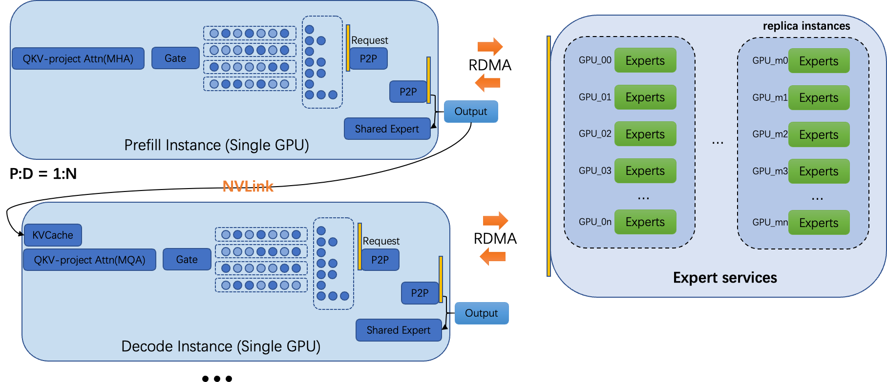
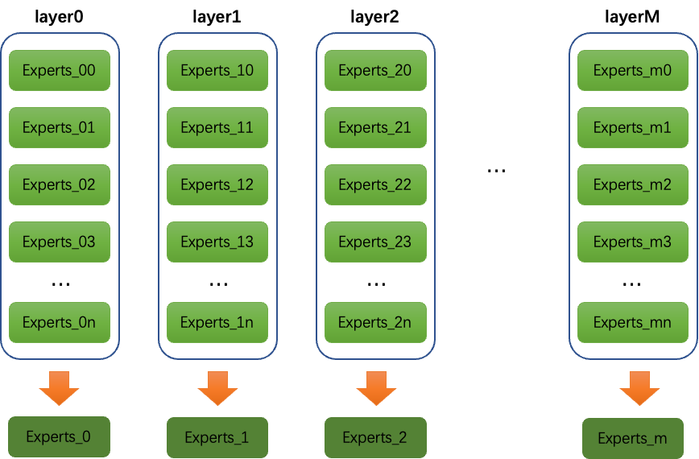
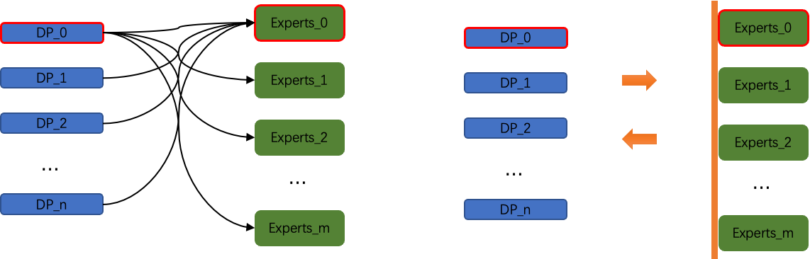

## Introduction  
A Novel Stable and Production-Ready Deployment Architecture for MOE Models

## Architectural Design  

As shown in the figure above, we can consider all Experts as many independent models and deploy these models separately. They can accept corresponding token requests and return the results to the requester after computation. In the Experts service, there is no communication between the Experts. If any GPU encounters an issue, we only need to restart (or repair) the faulty GPU, which will not affect other GPUs. The DP instances connected to the faulty Expert (whether P or D) only need to request other replicas. Thus, any GPU failure in the Experts model service will only affect that specific GPU and will not render other functioning GPUs unavailable. For DP (data parallel) instances, including P-type and D-type DP instances, once decoupled from the Experts, they will entirely become single-GPU data parallel and can support services independently. Their quantity can be flexibly adjusted based on traffic, with the adjustment granularity being a single GPU. Similarly, in the P and D instances, any GPU failure will not impact the services of other functioning GPU models. In summary, after the independence of the Experts, DeepSeek V3/R1 will closely resemble a deployable model on a single card, with availability, reliability, and scalability comparable to that of a single-card deployment model.

### Load Balancing

After the separation of Experts, the load balancing issue can be completely resolved. We do not need to add redundant experts to alleviate the load on hotspot experts. Specifically, as shown in the figure above, I can place all the Experts of corresponding layers onto a single card. As long as the probability of global DP instances running at each layer is the same at any given moment, complete load balancing can be achieved. This is entirely feasible because DP instances, whether P or D, are independent services. Their request acceptance times are random, so their execution states are also random. From a global perspective, complete load balancing can be easily achieved.

### Changes Brought by PD Separation

PD separation is no longer comprised of 4 Nodes (32xGPUs) for P instances and 18 Nodes (144xGPUs) for D instances, but rather consists of single-card instances. This greatly enhances flexibility, scalability, and reliability. Additionally, it allows for effective control of PD within the same machine and utilizes the high-speed NVLink channels within the machine.

### Anomaly Detection and Recovery

In this deployment scheme, all GPUs have independent tasks, enabling decoupling from other GPUs. This leads to more concentrated anomalies, more accurate detection, quicker recovery, and limited losses.

### Synchronous to Asynchronous

In this scheme, All2All synchronous communication will transform into multiple P2P asynchronous communications. Will this improve overall performance?

### Challenges

How to achieve efficient P2P connections between DP instances and Experts instances, and how to avoid having to re-establish connections for all interconnected Experts instances or DP instances after a disconnection. As shown in the figure below:

If connections are established using the method shown in the left image above, efficient RDMA communication can reduce latency. However, if a DP instance or an Experts instance fails, it will affect the connected DP instances or Experts instances, as indicated by the red-bordered instances in the upper left image. If our DP instances and Experts instances are not directly connected but instead routed through a common interface, this can effectively block the mutual influence between DP instances and Experts instances. However, the question remains whether this approach can be efficient enough, given that each layer needs to request Experts instances frequently and has high time requirements. If there are experts in communication, your insights would be greatly appreciated.